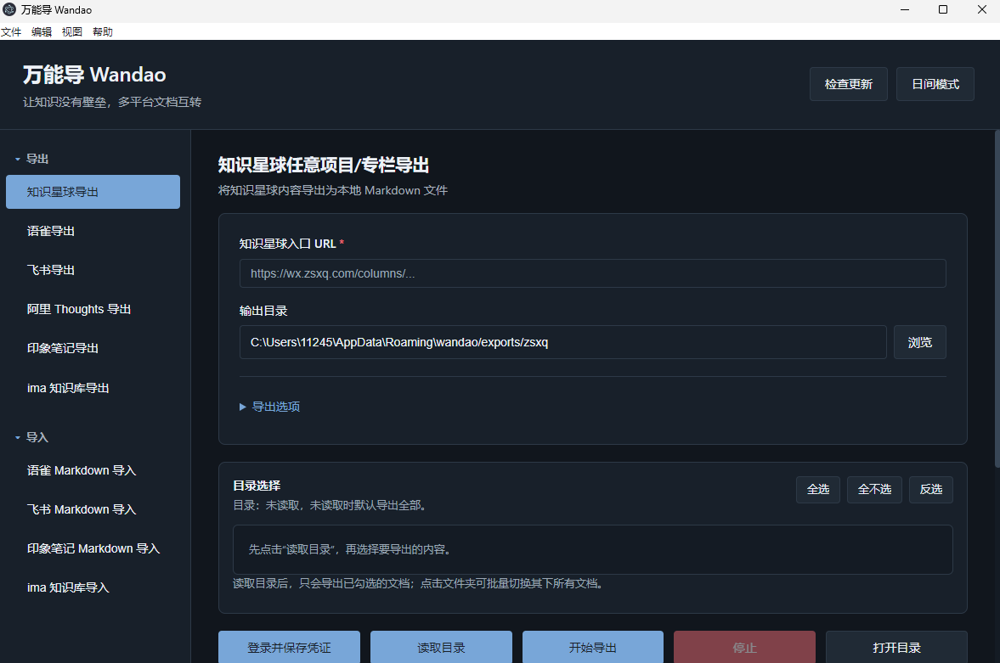

# 万能导 Wandao

> 让知识没有壁垒，多平台文档互转。用自动化脚本代替用户手动打开页面、复制正文、整理目录、搬运文档的重复劳动。

[](LICENSE)
[](https://www.python.org/)
[](#系统要求)
[](https://github.com/tllovesxs/wandao)

万能导希望解决一个很朴素的问题：知识不应该被平台格式、复制粘贴和目录迁移卡住。你可以把自己有权限访问的项目教学资料、团队知识库、课程文档转换为本地 Markdown，也可以把整理好的本地 Markdown 再导入到支持的平台里，并保留目录层级和正文图片以及格式。
关键词:语雀转飞书,语雀导出,飞书导出,知识星球导出,阿里云导出,印象笔记导入.

导出的文档可以和源码项目放在一起，再交给 AI 阅读，让 AI 同时理解“教学文档 + 真实代码 + 项目结构”。这样学习大型项目时，资料不再散落在多个页面里，提问也不再只是孤立地复制一小段内容。

Author: `tllovesxs`

## 项目信息

| 项目 | 内容 |
|------|------|
| GitHub | [tllovesxs/wandao](https://github.com/tllovesxs/wandao) |
| 发行版下载 | [Releases](https://github.com/tllovesxs/wandao/releases) |
| 问题反馈 | [Issues](https://github.com/tllovesxs/wandao/issues) |
| 作者微信 | `pressure_spring` |
| 联系邮箱 | `tl200599@163.com` |

## 参与贡献

欢迎提交 Issue 和 Pull Request。Bug 反馈、平台适配、导入导出效果优化、文档补充和界面体验改进都可以参与。

提交前请先阅读 [CONTRIBUTING.md](CONTRIBUTING.md)。请不要在 Issue、PR、截图或日志里提交 Cookie、账号密码、App Secret、Token 等敏感信息。

## 功能特性

| 功能 | 说明 |
|------|------|
| 多平台互转 | 支持多个知识库平台导出为 Markdown，并支持本地 Markdown 导入飞书 Wiki、语雀和印象笔记 |
| 图形化界面 | 提供统一桌面端，侧边栏按“导出 / 导入”分类展示平台入口 |
| 夜间模式 | 顶部可切换日间/夜间主题，并记住用户偏好 |
| 版本检查 | 支持检测 GitHub Releases 是否有新版本，发现新版后提示前往下载 |
| 目录选择 | 先读取目录，再选择全部导出或只导出部分章节 |
| 进度反馈 | 导出、导入、读取目录时显示全局进度条和实时日志 |
| 增量更新 | 已导出的文档会跳过，缺失或需要深入的链接可以继续补齐 |
| Markdown 中转 | 按目录结构保存为 Markdown，并生成入口索引和处理报告 |
| 文档导入 | 支持将本地 Markdown 批量导入飞书 Wiki，并恢复多层文件夹结构 |
| 语雀导入 | 支持将本地 Markdown 创建/更新到语雀知识库，并生成导入索引 |
| 印象笔记导出 | 支持印象笔记同步到本地后按笔记本目录导出 Markdown |
| 印象笔记导入 | 支持将本地 Markdown 批量导入印象笔记，并上传本地图片和附件 |
| 评论区可选 | 知识星球导出可选择是否同时保存页面可见评论区内容 |
| 图片与附件本地化 | 尽量下载正文图片到本地 `assets/`，下载语雀/印象笔记等附件到本地附件目录，减少后续失效风险 |
| 浏览器自动查找 | 自动扫描 Chrome、Edge、Chromium，也支持用户手动指定浏览器 |
| 请求节奏控制 | 内置固定延迟和随机浮动，尽量模拟正常阅读和复制粘贴节奏 |
| 停止按钮 | 导出过程中可以随时停止，已完成的文件会保留 |

## 截图预览

桌面端主界面：

<p align="left">
  
</p>

## 支持范围

- 支持知识星球任意项目、专栏、帖子和文章页导出为 Markdown。
- 支持语雀任意知识库导出为 Markdown，并尽量本地化正文图片和附件。
- 支持本地 Markdown 批量导入语雀知识库，并恢复目录层级、图片和附件链接。
- 支持飞书任意 Wiki 知识库导出为 Markdown。
- 支持阿里云 Thoughts 任意工作区导出为 Markdown。
- 支持印象笔记任意笔记本导出为 Markdown。
- 支持本地 Markdown 批量导入飞书 Wiki，并恢复多层目录结构。(全网首发)
- 支持本地 Markdown 批量导入印象笔记，并按本地目录映射笔记本组和笔记本。

浏览器类平台会使用本机 Chrome/Edge 的调试协议打开页面，登录由用户自己完成，凭证文件只保存 Cookie，不保存账号密码。印象笔记会保存本机同步凭证，同样不保存明文密码。

## 系统要求

| 依赖 | 要求 |
|------|------|
| Python | 普通用户下载发行版时无需安装；源码运行和参与开发时需要 3.10 或更高版本 |
| Node.js | 仅源码运行桌面版、打包发行版或参与开发时需要 |
| 浏览器 | Chrome、Edge 或 Chromium |
| 权限 | 用户需要拥有目标知识库的正常访问权限 |

在新电脑上运行时，万能导会自动查找常见安装位置中的 Chrome、Edge 或 Chromium，也会读取 `PATH` 中的浏览器命令。如果浏览器安装在非常规位置，可以设置环境变量 `WANDAO_BROWSER` 指向浏览器可执行文件。

每个导出界面都有“浏览器程序路径”一栏：

- 点击“查找”会自动扫描浏览器。
- 点击“选择”可以手动指定浏览器程序。
- 如果没有找到浏览器，请先安装 Chrome、Edge 或 Chromium。

## 快速开始

### 快速使用：下载发行版

1. 打开项目的 [Releases](https://github.com/tllovesxs/wandao/releases) 页面。
2. 下载对应系统的安装包，例如 Windows 的 `.exe`，或 macOS 的 `.zip` 压缩包。
3. 安装后打开 `Wandao`。
   > **macOS 用户注意**：从 GitHub 下载的应用会被 macOS 标记隔离属性，首次打开可能提示”已损坏，无法打开”。这不是应用本身的问题，而是系统为了防止未签名应用运行所做的拦截。请在终端执行以下命令（将路径替换为 `Wandao.app` 实际所在位置）后再打开：
   > ```bash
   > xattr -cr /Applications/Wandao.app
   > ```
4. 在左侧展开”导出”或”导入”，选择目标平台。
5. 填写入口链接或本地目录，按界面提示登录、读取目录、选择范围并执行任务。

顶部“夜间模式”可切换深色界面；“检查更新”会检测 GitHub Releases 是否有新版本，发现新版后会提示前往下载。

普通用户推荐直接下载发行版，不需要手动拉取源码，也不需要额外安装 Python。发行版会自带运行导入导出脚本所需的 Python 运行时和依赖。

### 协助开发：拉取源码

如果你想参与开发、调试问题，或者当前还没有适合你系统的发行版，可以拉取源码运行桌面版。

Windows PowerShell：

```powershell
git clone https://github.com/tllovesxs/wandao.git
cd wandao
python -m venv .venv
.\.venv\Scripts\activate
python -m pip install -r requirements.txt
cd wandao_electron
npm install
npm start
```

macOS/Linux：

```bash
git clone https://github.com/tllovesxs/wandao.git
cd wandao
python3 -m venv .venv
source .venv/bin/activate
python3 -m pip install -r requirements.txt
cd wandao_electron
npm install
npm start
```

如果启动时提示 `electron` 不是可执行命令，通常是还没有在 `wandao_electron` 目录执行 `npm install`。

### 发行包构建说明

发行包会在打包前自动准备内置 Python 运行时。构建产物里的用户不需要手动安装 Python。

Windows 发行包可以在 Windows 本机生成：

```powershell
cd wandao_electron
npm ci
npm run build:win
```

macOS 应用压缩包需要在 macOS 环境构建。推荐使用项目内置的 GitHub Actions workflow 分别生成 Intel 和 Apple Silicon 版本；如果在 macOS 本机打包，可以执行：

```bash
cd wandao_electron
npm ci
npm run build:mac:x64      # Intel Mac
npm run build:mac:arm64    # Apple Silicon Mac
```

在 Windows 上准备发布时，可以先生成 Windows `.exe`；真正的 macOS App `.zip` 由 macOS runner 或 Mac 本机构建后上传 Release。

### 备用方式：Python 启动器

```powershell
git clone https://github.com/tllovesxs/wandao.git
cd wandao
python -m venv .venv
.\.venv\Scripts\activate
python -m pip install -r requirements.txt
python wandao.py
```

这个方式适合开发、调试，或者桌面版暂时无法启动时使用。启动后选择要导出的知识库类型，然后点击“打开导出界面”。

查看支持的平台：

```powershell
python wandao.py --list
```

## 基本流程

### 导出为 Markdown

1. 在左侧展开“导出”，选择对应平台。
2. 填写知识库入口 URL。
3. 点击“登录并保存凭证”，在浏览器中完成登录。
4. 点击“读取目录”，工具会读取并展示目录树。
5. 勾选要导出的目录或文档。
6. 点击“开始导出”。如果勾选了“增量导出”，工具只补本地缺失内容；取消勾选则会重新导出选中内容。

未读取目录时，默认导出该入口下可识别的全部内容。

印象笔记导出不需要入口 URL。第一次使用时，在左侧选择“印象笔记导出”，填写账号和密码后点击“登录并同步”。工具会把同步凭证保存在本机同步库里，不会保存明文密码。同步完成后点击“读取目录”，再勾选笔记本或笔记并导出。

### 印象笔记 Markdown 导入

1. 在左侧展开“导入”，选择“印象笔记 Markdown 导入”。
2. 第一次使用先填写印象笔记账号和密码，点击“登录并同步凭证”。已有本地同步库时可以跳过这一步。
3. 选择本地 Markdown 目录。
4. 填写默认目标笔记本；如果勾选“按本地目录创建笔记本组/笔记本”，工具会把一级目录作为笔记本组，后续目录作为笔记本名。
5. 点击“扫描目录”，确认即将导入的 Markdown 数量。
6. 点击“单篇导入测试”，确认正文、图片和附件正常。
7. 点击“批量导入”。

印象笔记导入会把本地图片和普通附件作为 Resource 写入笔记。Markdown 是通用格式，不同平台导出的复杂表格、折叠块或特殊组件可能会被简化为普通文本或基础 HTML。

### 语雀 Markdown 导入

1. 在左侧展开“导入”，选择“语雀 Markdown 导入”。
2. 填写目标语雀知识库 URL。
3. 点击“登录并保存凭证”，在浏览器里登录语雀并确认能访问目标知识库。
4. 回到工具点击“我已完成登录，保存凭证”。
5. 选择本地 Markdown 目录。
6. 点击“生成计划”，确认即将导入的文档数量、目录层级、图片和附件数量。
7. 点击“单篇导入测试”，确认标题、正文格式、图片、附件和目录位置正常。
8. 点击“批量导入”。

语雀导入会按本地文件夹创建语雀目录，使用相对路径的本地图片会上传到语雀并替换为在线图片，普通附件也会上传并替换为语雀附件链接。为了避免同名标题互相覆盖，工具会根据本地相对路径生成稳定 slug；同一批文档再次导入时会更新对应文档。

### 飞书 Markdown 导入全流程

飞书导入比普通导出多了开放平台配置，建议第一次按下面顺序来，不要跳步：

1. 在左侧展开“导入”，选择“飞书 Markdown 导入”。
2. 在“目标飞书 Wiki URL”里粘贴要导入到的 Wiki 页面链接。
3. 在“Markdown 目录”里选择本地 `.md` 文件所在目录；如果只想先测一篇，可以在“单篇测试文件”里选一个 `.md`。
4. 点击“打开飞书开放平台”，在飞书开放平台创建企业自建应用。
5. 进入应用的“凭证与基础信息”，复制 `App ID` 和 `App Secret`，填回万能导，然后点击“保存 API 配置”。
6. 点击“初始化开放平台权限”。工具会打开当前应用的权限页和版本发布页。请开通这些权限并发布新版本：`drive:drive`、`drive:file:upload`、`docs:permission.member:create`、`docs:document:import`、`docx:document`、`docx:document:write_only`、`wiki:wiki`。
7. 点击“检查应用身份”。如果日志提示没有启用机器人，就在自动打开的机器人页面启用机器人能力，然后再次发布应用新版本。
8. 点击“授权目标 Wiki 文档应用”。如果工具无法自动完成，请到目标 Wiki 页面右上角选择“... -> 更多 -> 添加文档应用”，搜索当前企业自建应用名称，并设置为可编辑。
9. 点击“登录并保存凭证”。浏览器打开后登录飞书，确认能看到目标 Wiki 页面，再回到万能导点击“我已完成登录，保存凭证”。
10. 点击“探测目标 Wiki”。成功后工具会识别 `spaceId` 和目标父级页面。
11. 点击“生成计划”。这一步只扫描本地 Markdown，不会创建飞书文档，用来确认即将导入哪些文件。
12. 点击“单篇导入测试”。确认一篇文档的标题、正文、图片和层级正常后，再继续。
13. 点击“批量导入”。工具会按本地文件夹层级创建飞书文档，并尽量修复本地图片。

飞书导入需要用户自己创建企业自建应用并填写 App ID / App Secret。工具只负责打开配置页面、保存本机配置、调用飞书 OpenAPI，不会替用户收集或上传密钥。如果导入时遇到 `99991672` 权限不足，工具会自动打开飞书返回的权限申请页。

如果导入时报 `131006` 或 `no destination parent node permission`，说明不是开放平台 scope 没开，而是目标 Wiki 父页面没有把当前企业自建应用加入“文档应用”列表。请点击“授权目标 Wiki 文档应用”，或在目标 Wiki 右上角选择“... -> 更多 -> 添加文档应用”，搜索当前应用名称并添加为可编辑。

## 输出内容

默认输出到项目目录下的 `exports/`：

```text
exports/
  zsxq/
  yuque/
  feishu/
  aliyun-thoughts/
  yinxiang/
```

每次导出通常会生成：

| 文件或目录 | 说明 |
|------------|------|
| `00-知识库入口.md` | 本地目录索引 |
| `00-导出报告.json` | 导出统计、失败项、图片和附件下载情况 |
| `assets/` | 正文图片资源 |
| `attachments/` | 附件资源，当前主要用于语雀、印象笔记等带文件附件的平台 |
| `*.md` | 按目录结构导出的 Markdown 文档 |

## 命令行示例

直接打开某个平台：

```powershell
python wandao.py --provider zsxq --gui
python wandao.py --provider yuque --gui
python wandao.py --provider feishu --gui
python wandao.py --provider aliyun-thoughts --gui
python wandao.py --provider yinxiang --gui
python wandao.py --provider yinxiang-import --gui
```

知识星球任意项目：

```powershell
python wandao.py --provider zsxq -- --entry-url "https://wx.zsxq.com/columns/..." --output "./exports/zsxq" --incremental --include-comments
```

语雀任意知识库：

```powershell
python wandao.py --provider yuque -- --book-url "https://www.yuque.com/<namespace>/<book>" --output "./exports/yuque" --incremental
```

语雀导出默认会尝试下载图片和附件。如果附件很大，或只想保留远程附件链接，可以追加 `--skip-attachments`。

语雀 Markdown 导入：

```powershell
python wandao.py --provider yuque-import -- --target-book-url "https://www.yuque.com/<namespace>/<book>" --login
python wandao.py --provider yuque-import -- --target-book-url "https://www.yuque.com/<namespace>/<book>" --source-dir "./exports/yuque" --plan
python wandao.py --provider yuque-import -- --target-book-url "https://www.yuque.com/<namespace>/<book>" --source-dir "./exports/yuque" --api-import-one --yes
python wandao.py --provider yuque-import -- --target-book-url "https://www.yuque.com/<namespace>/<book>" --source-dir "./exports/yuque" --api-import-all --yes
```

飞书任意 Wiki：

```powershell
python wandao.py --provider feishu -- --wiki-url "https://<tenant>.feishu.cn/wiki/<token>" --output "./exports/feishu" --incremental
```

阿里云 Thoughts 任意工作区：

```powershell
python wandao.py --provider aliyun-thoughts -- --workspace-url "https://thoughts.aliyun.com/workspaces/<id>/overview" --output "./exports/aliyun-thoughts" --incremental
```

印象笔记任意笔记本：

```powershell
# 第一次使用：初始化本地同步库。密码会从标准输入读取，不会放进命令行参数。
python export_yinxiang.py --init-auth --username "你的印象笔记账号" --password-stdin

# 读取目录
python export_yinxiang.py --scan-toc

# 导出全部
python wandao.py --provider yinxiang -- --output "./exports/yinxiang" --incremental
```

印象笔记 Markdown 导入：

```powershell
# 先扫描本地 Markdown
python wandao.py --provider yinxiang-import -- --source-dir "./exports/yuque" --scan-source

# 单篇导入测试
python wandao.py --provider yinxiang-import -- --source-dir "./exports/yuque" --notebook "万能导导入" --import-one --yes

# 批量导入，并按本地目录映射笔记本组/笔记本
python wandao.py --provider yinxiang-import -- --source-dir "./exports/yuque" --notebook "万能导导入" --preserve-folders --import-all --yes
```

浏览器安装在非常规位置时：

```powershell
python wandao.py --provider zsxq -- --browser-path "C:\Program Files\Google\Chrome\Application\chrome.exe" --entry-url "https://wx.zsxq.com/columns/..."
```

## 配合 AI 学习项目

万能导适合和 AI 编程/阅读工具一起使用。推荐流程：

1. 用万能导把你有权限访问的教学文档导出为 Markdown。
2. 把导出的知识库目录复制到对应源码项目里，例如：

```text
your-project/
  src/
  docs/
  exported-knowledge/
    00-知识库入口.md
    01-项目介绍.md
    ...
```

3. 用 AI 工具打开整个 `your-project/` 目录，让 AI 同时看到源码和导出的教学文档。
4. 把 [prompts/项目学习导师提示词.md](prompts/项目学习导师提示词.md) 里的提示词发给 AI。
5. 之后就可以按章节、功能或技术点提问，例如“讲一下订单下单流程”“讲一下 Redis Lua 防超卖”“这一章和代码实现对应在哪里”。

这样做的核心思路是：先让 AI 阅读教学文档，再对照真实源码讲解，避免只凭通用知识泛泛回答。

## 请求节奏

万能导默认在文档/API 请求前等待：

```text
固定延迟 0.8 秒 + 随机浮动 0~0.4 秒
```

也就是平均约 1 秒。这个设计是为了让自动化过程更接近用户手动浏览和复制粘贴的节奏，降低高频请求风险。你可以在 GUI 中调整，也可以使用命令行参数：

```powershell
--request-delay 0.8 --request-jitter 0.4
```

导出过程中可以随时点击“停止当前任务”，工具会在安全点停止并保留已经导出的文件。

## 知识星球链接深度

知识星球导出默认 `--max-depth 2`，会导出目录文章本身，并继续进入正文里的下一层知识星球链接。GUI 中对应字段是“最多进入几层URL”。

知识星球评论区默认不导出。需要保存评论时，可以在 GUI 勾选“同时导出评论区”，或在命令行增加 `--include-comments`。开启后工具会额外滚动页面并尝试展开可见评论，然后把评论追加到 Markdown 的“评论区”章节。

## 合规说明

本项目的目标是减少用户手动复制粘贴的机械劳动。它不会破解登录、不绕过权限控制，也不提供未授权内容访问能力。

使用本项目时请确认：

- 你对目标内容拥有访问权限。
- 你的使用方式符合平台服务条款和版权要求。
- 不要将导出的内容用于未获授权的传播、售卖或公开发布。
- 不要调低延迟进行高频请求或批量滥用。

更多说明见 [docs/合规说明.md](docs/合规说明.md)。

## 项目结构

```text
wandao/
├── wandao.py                         # 统一启动器
├── export_zsxq.py                    # 知识星球导出器
├── export_yuque.py                   # 语雀导出器
├── export_feishu.py                  # 飞书导出器
├── export_aliyun_thoughts.py         # 阿里云 Thoughts 导出器
├── export_yinxiang.py                # 印象笔记导出器
├── import_yuque.py                   # 本地 Markdown 导入语雀
├── import_feishu.py                  # 本地 Markdown 导入飞书 Wiki
├── import_yinxiang.py                # 本地 Markdown 导入印象笔记
├── wandao_electron/                  # 统一 Electron 桌面端
├── prompts/项目学习导师提示词.md      # 项目学习提示词
├── docs/                             # 使用教程、合规说明和截图
└── exports/                          # 默认导出目录，本地生成，不提交仓库
```

## 友情链接

- [LINUX DO](https://linux.do) — 新的理想型社区

## License

本项目采用 [Apache License 2.0](LICENSE) 开源。

---

<p align="center">
  如果这个项目对你有帮助，欢迎在 GitHub 给一个 Star。
</p>
