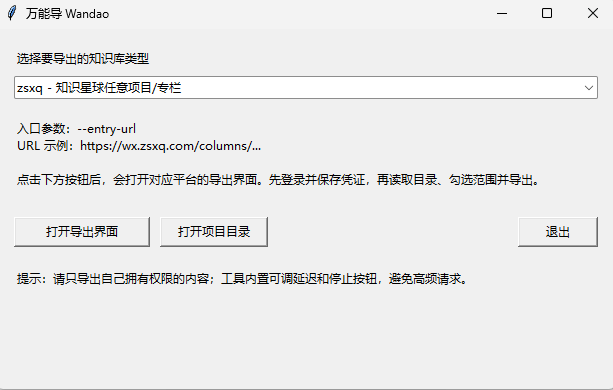

# 万能导 Wandao

万能导是一个多平台知识库导出工具，用浏览器自动化代替用户手动打开页面、复制正文、保存 Markdown 的重复劳动。

Author: `tllovesxs`

## 界面预览

统一启动器：



多平台导出界面：


## 支持范围

- 支持知识星球任意项目、专栏、帖子和文章页导出。
- 支持语雀任意知识库导出。
- 支持飞书任意 Wiki 知识库导出。
- 支持阿里云 Thoughts 任意工作区导出。

工具会使用本机 Chrome/Edge 的调试协议打开页面，登录由用户自己完成，凭证文件只保存 Cookie，不保存账号密码。

在新电脑上运行时，万能导会自动查找常见安装位置中的 Chrome、Edge 或 Chromium；也会读取 PATH 中的浏览器命令。如果浏览器安装在非常规位置，可以设置环境变量 `WANDAO_BROWSER` 指向浏览器可执行文件。

每个导出界面都有“浏览器程序路径”一栏：

- 点击“查找”会自动扫描浏览器。
- 点击“选择”可以手动指定浏览器程序。
- 如果没有找到浏览器，请先安装 Chrome、Edge 或 Chromium。

## 适用场景

- 你有权限访问某个知识库，希望备份到本地 Markdown。
- 你不想一篇篇手动复制粘贴，希望自动化完成重复操作。
- 你希望导出时保留目录结构、图片、本地索引和增量更新记录。

请只导出你拥有访问权限和合理使用权的内容，并遵守对应平台的服务条款、版权要求和团队规范。

## 快速开始

需要 Python 3.10+，无需安装第三方依赖。

```powershell
git clone <your-repo-url> wandao
cd wandao
python wandao.py
```

启动后选择要导出的知识库类型，然后点击“打开导出界面”。

也可以直接打开某个平台：

```powershell
python wandao.py --provider zsxq --gui
python wandao.py --provider yuque --gui
python wandao.py --provider feishu --gui
python wandao.py --provider aliyun-thoughts --gui
```

查看支持的平台：

```powershell
python wandao.py --list
```

## 基本流程

1. 填写知识库入口 URL。
2. 点击“登录并保存凭证”，在浏览器中完成登录。
3. 点击“读取目录”，工具会读取并展示目录树。
4. 勾选要导出的目录或文档。
5. 点击“增量导出选中/全部”或“全量导出选中/全部”。

未读取目录时，默认导出该入口下可识别的全部内容。

## 输出内容

默认输出到项目目录下的 `exports/`：

```text
exports/
  zsxq/
  yuque/
  feishu/
  aliyun-thoughts/
```

每次导出通常会生成：

- `00-知识库入口.md`：本地目录索引
- `00-导出报告.json`：导出统计、失败项、图片下载情况
- `assets/`：图片资源
- 若干 Markdown 文档

## 配合 AI 学习项目

万能导适合和 AI 编程/阅读工具一起使用。推荐流程：

1. 用万能导把你有权限访问的教学文档导出为 Markdown。
2. 把导出的知识库目录复制到对应源码项目里，例如：

```text
your-project/
  src/
  docs/
  exported-knowledge/
    00-知识库入口.md
    01-项目介绍.md
    ...
```

3. 用 AI 工具打开整个 `your-project/` 目录，让 AI 同时看到源码和导出的教学文档。
4. 把 [prompts/项目学习导师提示词.md](prompts/项目学习导师提示词.md) 里的提示词发给 AI。
5. 之后就可以按章节、功能或技术点提问，例如“讲一下订单下单流程”“讲一下 Redis Lua 防超卖”“这一章和代码实现对应在哪里”。

这样做的核心思路是：先让 AI 阅读教学文档，再对照真实源码讲解，避免只凭通用知识泛泛回答。

## 请求节奏

万能导默认在文档/API 请求前等待：

```text
固定延迟 0.8 秒 + 随机浮动 0~0.4 秒
```

也就是平均约 1 秒。这个设计是为了让自动化过程更接近用户手动浏览和复制粘贴的节奏，降低高频请求风险。你可以在 GUI 中调整，也可以使用命令行参数：

```powershell
--request-delay 0.8 --request-jitter 0.4
```

导出过程中可以随时点击“停止当前任务”，工具会在安全点停止并保留已经导出的文件。

## 知识星球链接深度

知识星球导出默认 `--max-depth 2`，会导出目录文章本身，并继续进入正文里的下一层知识星球链接。GUI 中对应字段是“最多进入几层URL”。

## 合规说明

本项目的目标是减少用户手动复制粘贴的机械劳动。它不会破解登录、不绕过权限控制，也不提供未授权内容访问能力。

使用本项目时请确认：

- 你对目标内容拥有访问权限。
- 你的使用方式符合平台服务条款和版权要求。
- 不要将导出的内容用于未获授权的传播、售卖或公开发布。
- 不要调低延迟进行高频请求或批量滥用。

更多说明见 [docs/合规说明.md](docs/合规说明.md)。

## 命令行示例

知识星球任意项目：

```powershell
python wandao.py --provider zsxq -- --entry-url "https://wx.zsxq.com/columns/..." --output "./exports/zsxq" --incremental
```

语雀任意知识库：

```powershell
python wandao.py --provider yuque -- --book-url "https://www.yuque.com/<namespace>/<book>" --output "./exports/yuque" --incremental
```

飞书任意 Wiki：

```powershell
python wandao.py --provider feishu -- --wiki-url "https://<tenant>.feishu.cn/wiki/<token>" --output "./exports/feishu" --incremental
```

阿里云 Thoughts 任意工作区：

```powershell
python wandao.py --provider aliyun-thoughts -- --workspace-url "https://thoughts.aliyun.com/workspaces/<id>/overview" --output "./exports/aliyun-thoughts" --incremental
```

浏览器安装在非常规位置时：

```powershell
python wandao.py --provider zsxq -- --browser-path "C:\Program Files\Google\Chrome\Application\chrome.exe" --entry-url "https://wx.zsxq.com/columns/..."
```

## License

MIT
