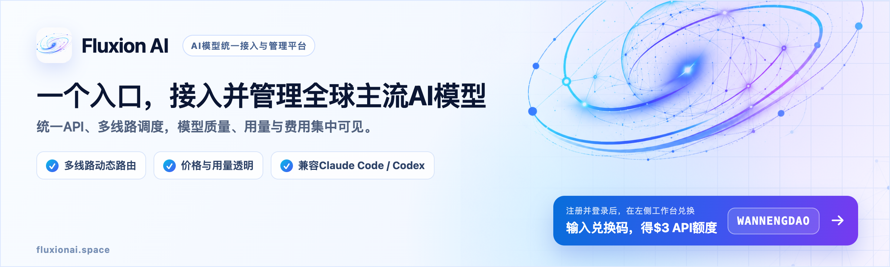

# Fluxion AI · 为 AI 辅助学习提供支持

> 本区为赞助信息。万能导始终完全开源免费，AI 辅助学习不绑定任何模型或 API 服务。

[**Fluxion AI**](https://fluxionai.space/register?source=github&campaign=wandao) 面向个人开发者、技术团队与企业，通过统一 API 接入全球主流 AI 模型，并以多线路调度提升可用性；模型质量、使用情况和费用可在一个平台集中管理。

灵活的线路与计费方案带来更具竞争力的调用成本，实时价格和每笔消费均可查阅。

## 兑换福利

登录后在工作台「兑换」输入兑换码 `WANNENGDAO`，即可获得 $3 API 额度。

[访问 Fluxion AI](https://fluxionai.space/register?source=github&campaign=wandao)
