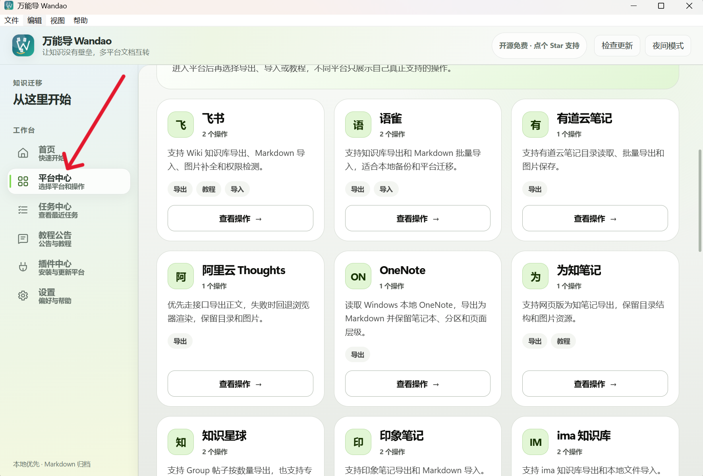
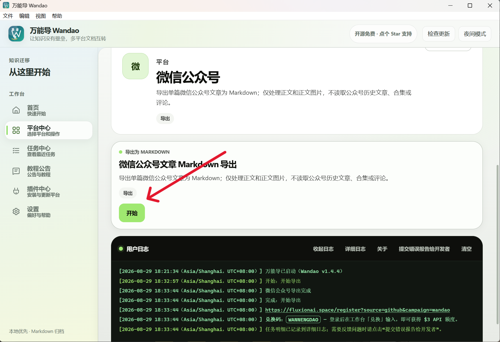
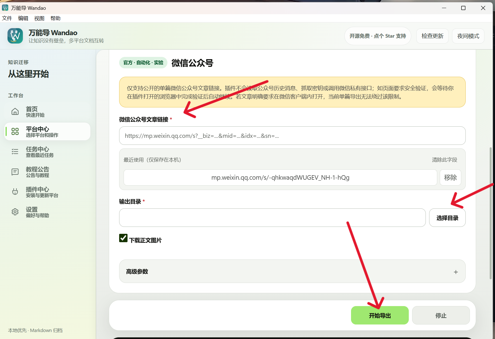
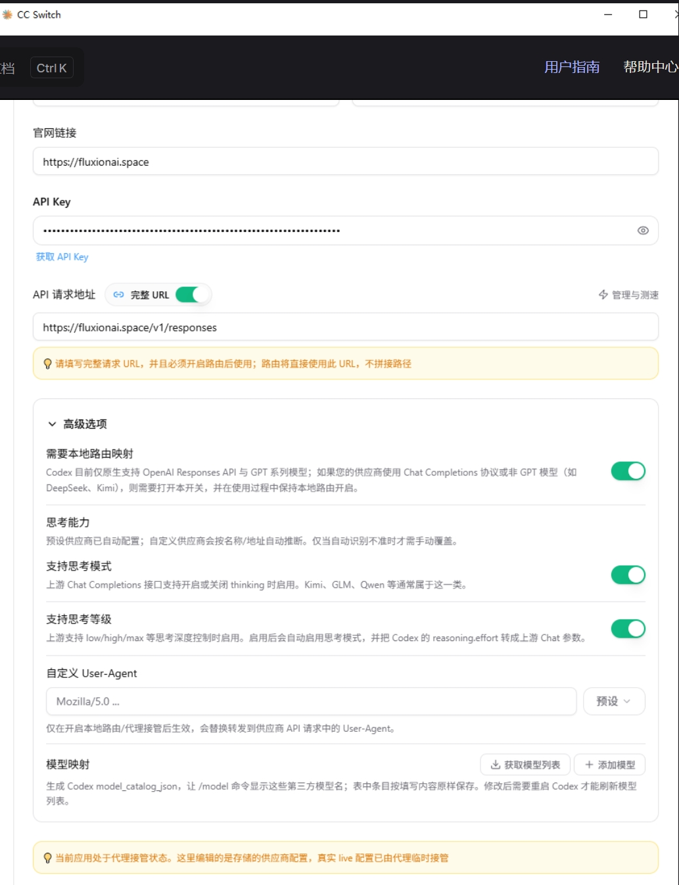
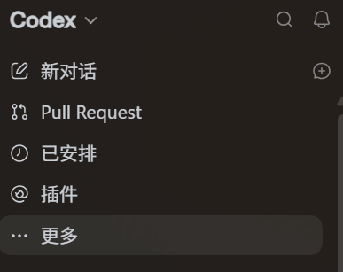
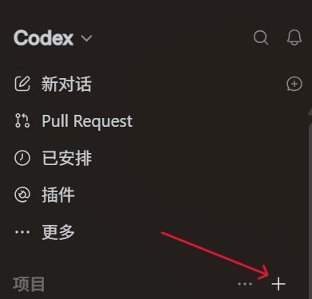
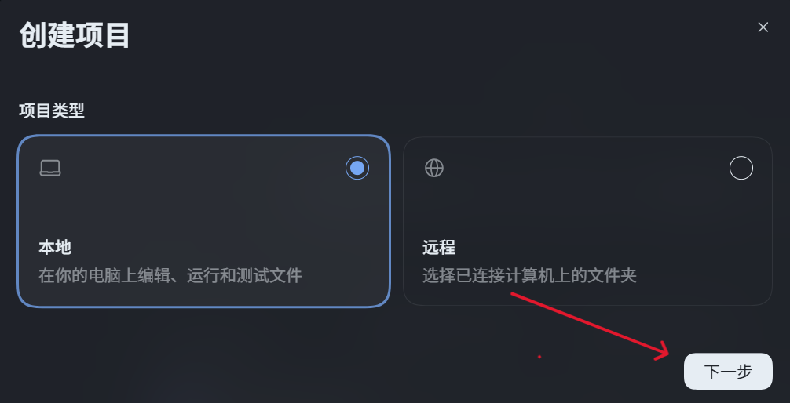
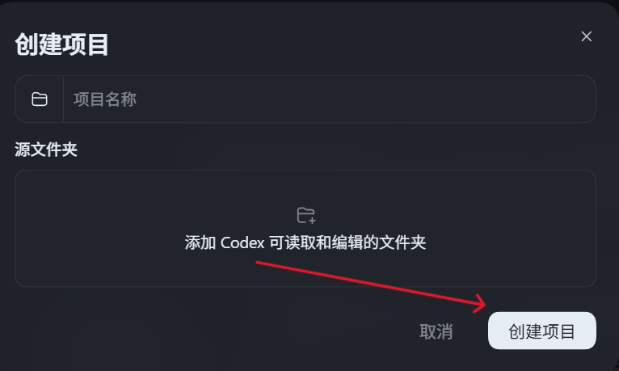

# 用万能导 + Codex 辅助学习代码项目

很多代码项目同时提供源码和配套教学文档，但真正学习时，我们经常需要在课程平台、浏览器、编辑器和源码目录之间反复切换。

万能导可以把你有权限访问的课程文档或知识库导出为本地 Markdown。再把这些教学文档和源码放进同一个 Codex 项目，AI 就能结合“文档讲了什么”和“代码实际怎么实现”带你学习业务流程、核心代码和技术取舍。

本教程将完成下面这条学习链路：

1. 使用万能导导出教学文档。
2. 把 Markdown 文档和源码整理到同一个学习目录。
3. 通过 CC-Switch 为 Codex 配置 API Key。
4. 在 Codex 中创建本地项目。
5. 发送项目学习导师提示词并开始提问。

## 一、使用万能导导出教学文档

### 1. 进入平台中心

启动万能导后，点击左侧的“平台中心”。平台中心列出了当前可以使用的导出、导入和教程功能。



选择教学文档所在的平台，然后点击“查看操作”。不同平台支持的能力不同，只会显示该平台已经实现的操作。

### 2. 开始导出

进入平台页面后，找到“导出”操作并点击“开始”。



根据页面提示填写文档链接、知识库地址或其他必要信息，并选择输出目录。



为了让 AI 能同时理解文档中的文字和示意图，建议勾选“下载正文图片”。如果平台支持目录读取，可以先点击“读取目录”，只勾选需要学习的课程或章节。

确认参数后点击“开始导出”。完全成功时，用户日志会显示“导出完成”；如果任务部分成功、暂停或失败，请先在“任务中心”查看报告并补齐失败内容，再进入后续学习步骤。

不同平台的登录和导出步骤可能略有差异，但整体流程相同：

1. 选择平台和导出操作。
2. 登录平台或填写文档链接。
3. 选择本地输出目录。
4. 读取并勾选需要导出的目录。
5. 开始导出并确认任务完全成功。

> 请只导出自己有权限访问的内容，不要把账号凭证、私人知识库或未脱敏资料提交到公开仓库。

## 二、整理源码和教学文档

导出完成后，把源码和 Markdown 教学文档放进同一个学习根目录。推荐使用下面的结构：

```text
project-learning/                 # 稍后在 Codex 中选择这个共同根目录
├─ source-code/                   # 项目的真实源码
│  ├─ src/                        # 主要业务代码
│  ├─ pom.xml                     # 示例：项目构建配置
│  └─ README.md                   # 项目自身的说明文档
└─ exported-docs/                 # 万能导导出的教学 Markdown
   ├─ 00-知识库入口.md             # 教学文档入口或目录
   ├─ 01-项目介绍.md               # 示例：项目背景与业务介绍
   ├─ 02-业务流程.md               # 示例：业务流程教学资料
   └─ images/                     # 教学文档引用的本地图片
```

你可以在万能导中直接把输出目录设置为 `project-learning/exported-docs/`，也可以在导出完成后把整个导出目录复制到这里。

后面创建 Codex 项目时，应选择 `project-learning/` 这个共同根目录，而不是只选择 `source-code/`。这样 Codex 才能同时读取源码和教学文档。

## 三、为 Codex 配置 API Key

API Key 可以理解为 AI 服务给客户端发放的“访问凭证”。Codex 发起模型请求时，会通过 API Key 确认可以使用哪些模型以及从哪里扣除额度。

### 1. 准备 API Key

登录 [Fluxion AI](https://fluxionai.space/register?source=github&campaign=wandao)，在工作台创建适用于 OpenAI 接口格式的 API Key。

兑换码：`WANNENGDAO` — 登录后在工作台“兑换”输入，即可获得 `$3` API 额度。

请同时确认 API Key 所属分组支持准备使用的模型。API Key 属于敏感凭证，不要把真实密钥发送给 AI、写入教学文档、提交到 Git，或者显示在公开截图中。

### 2. 在 CC-Switch 中添加 Codex Provider

CC-Switch 用于管理多个 AI 服务提供商，并把选中的配置应用到 Codex。可以从 [CC-Switch 官方仓库](https://github.com/farion1231/cc-switch) 查看安装说明。

打开 CC-Switch，切换到 Codex，然后添加一个自定义 Provider。


### 3. 填写连接参数

使用 OpenAI 分组的 API Key 时，填写下面这些参数：

```text
API Key：你在 Fluxion AI 创建的 API Key
# 这是敏感凭证，只填写在 CC-Switch 的密钥输入框中。

Base URL：https://fluxionai.space/v1
# Codex 使用 OpenAI 接口格式，因此填写 OpenAI 分组地址。

完整请求地址：https://fluxionai.space/v1/responses
# 仅在客户端要求填写完整接口地址时使用，Codex 使用 Responses 接口。

Model：从 Fluxion AI“模型广场”复制的模型名称
# 模型名称必须属于当前 API Key 所绑定的分组。
```



如果需要使用多个模型，可以继续配置模型映射。模型名称必须与“模型广场”展示的名称一致。


保存配置后，点击该 Provider 的“使用”按钮，再启动或重新打开 Codex。

如果出现无法连接或找不到模型，优先检查：

1. API Key 是否复制完整、是否仍然有效。
2. Base URL 是否填写为 `https://fluxionai.space/v1`。
3. 模型名称是否与模型广场完全一致。
4. API Key 所属分组是否支持当前模型。
5. CC-Switch 中是否已经点击该配置的“使用”按钮。

## 四、在 Codex 中创建学习项目

### 1. 打开项目区域

安装并打开 [Codex](https://openai.com/zh-Hans-CN/codex/)。如果侧栏没有直接显示“项目”，先点击“更多”，再进入“项目”。



点击“项目”右侧的加号，开始创建项目。


### 2. 创建本地项目

项目类型选择“本地”，让 Codex 直接读取电脑上的源码和教学文档，然后点击“下一步”。



填写一个容易识别的项目名称，例如“商城项目学习”。在“源文件夹”中添加前面准备好的 `project-learning/` 共同根目录，确认后点击“创建项目”。



创建完成后，先确认 Codex 可以同时看到：

- `source-code/`：项目真实源码。
- `exported-docs/`：万能导导出的教学文档和图片。

如果两者不在同一个父目录，也可以把源码目录和导出文档目录分别添加为项目的源文件夹。

## 五、发送项目学习导师提示词

在刚创建的项目中开始一个新对话，然后打开万能导仓库中的 [`prompts/项目学习导师提示词.md`](https://github.com/tllovesxs/wandao/blob/main/prompts/%E9%A1%B9%E7%9B%AE%E5%AD%A6%E4%B9%A0%E5%AF%BC%E5%B8%88%E6%8F%90%E7%A4%BA%E8%AF%8D.md)，复制文件里的完整提示词发送给 AI。

这段提示词会要求 AI：

1. 每次先阅读教学文档，再查看真实源码。
2. 结合文档、代码和业务场景进行讲解。
3. 先解释概念，再解释它在项目中的用法。
4. 重点说明为什么这样设计以及有哪些替代方案。
5. 对比教学文档和实际代码，主动指出差异。
6. 把核心设计整理成面试问答。

发送导师提示词后，可以先让 AI 建立项目全景：

```text
请先不要修改任何文件，只进行阅读和分析。

请先阅读 exported-docs 中的教学文档，再阅读 source-code 中的源码，然后告诉我：
1. 教学文档包含哪些章节；
2. 源码包含哪些主要模块；
3. 文档章节和源码模块之间有什么对应关系；
4. 建议我按照什么顺序学习这个项目。
```

## 六、如何向 AI 提问

AI 已经了解教学文档和源码后，不建议只问“这个项目讲了什么”。问题越具体，讲解越容易落到真实代码上。

### 按章节学习

```text
请讲解教学文档中的“订单创建”这一章。
先用通俗语言说明它解决什么问题，再找到对应源码，按照真实调用顺序讲解完整流程。
```

### 按功能追踪源码

```text
请从用户点击“提交订单”开始，追踪请求经过的 Controller、Service、数据库和消息队列。
请给出对应文件和函数，并说明每一步为什么存在。
```

### 补充前置知识

```text
我不理解这里的 Session。
请先用生活中的例子解释 Session，再讲它在这个项目中的创建、保存、读取和失效流程。
```

### 对比文档和实现

```text
请对比这一章教学文档和真实源码。
如果文档已经过时、遗漏异常分支，或者代码采用了不同实现，请明确列出差异，不要自行猜测。
```

### 理解技术取舍

```text
为什么这个功能使用当前方案？
还可以使用哪些替代方案？请比较它们的优缺点、适用规模和演进方向。
```

### 面试复习

```text
请把这个功能整理成面试问答：
1. 面试官真正想考什么；
2. 项目的技术亮点是什么；
3. 当前方案有什么不足；
4. 我可以怎样用两分钟回答。
```

## 七、推荐的学习顺序

可以按照下面的循环逐章学习：

1. 选择一个教学章节或业务功能。
2. 让 AI 先阅读对应教学文档。
3. 让 AI 定位并阅读真实源码。
4. 让 AI 画出模块调用流程。
5. 追问关键代码为什么这样设计。
6. 对比其他方案的优缺点。
7. 让 AI 出题检查你的理解。
8. 最后整理成自己的项目笔记和面试答案。

万能导负责把分散的教学资料整理成 Markdown，Codex 负责同时阅读教学文档和真实源码，而项目学习导师提示词负责约束讲解顺序。三者结合后，AI 才不只是泛泛回答问题，而是能够围绕你正在学习的真实项目进行讲解。
