# 万能导使用教程

## 简介

万能导是一个多平台知识库 Markdown 导入导出工具，目前支持飞书、语雀、阿里云 Thoughts、印象笔记、有道云笔记、为知笔记、OneNote、知识星球、ima 知识库、钉钉文档、WPS 文档、息流、Obsidian、Notion、知乎、CSDN、微信公众号和本地 Markdown 等内容来源与目标平台。

你可以把自己有权限访问的项目资料、团队知识库和课程文档导出为本地 Markdown，也可以把整理好的本地 Markdown 导入到支持的平台。万能导重点处理文档格式、图片、附件和目录层级，适合知识备份、平台迁移、学习资料整理，以及将“教学文档 + 源码项目”交给 AI 一起阅读。

如果有未能完整导出的内容或希望支持的新平台，欢迎提交 [GitHub Issue](https://github.com/tllovesxs/wandao/issues)。建议新平台不要求参与开发，平台使用经验、公开资料和测试意愿同样有价值；每一条可复现的反馈和共创需求都会被认真审查。

如果这个项目对你有帮助，欢迎在 GitHub 点一个 Star ⭐，这对我真的很重要~

## 新手上路
主界面
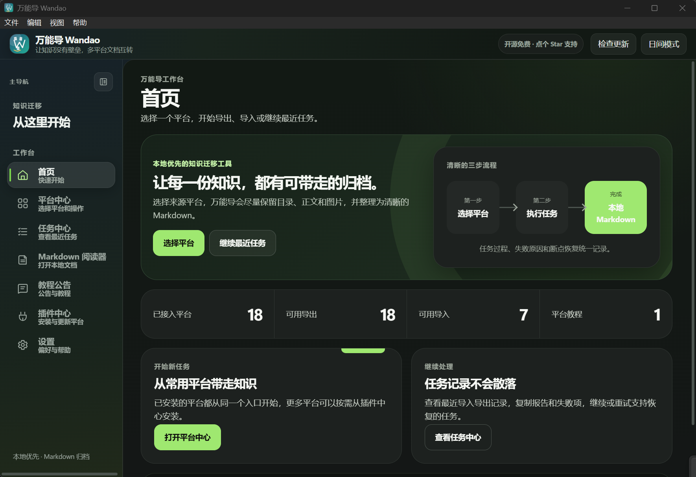

### 1. 平台中心

平台中心是万能导的核心入口，展示了目前支持的所有平台。每个平台卡片会标明该平台支持的操作（导出、导入、教程等），进入平台后再选择具体操作，不同平台只展示自己真正支持的选项，避免误操作。

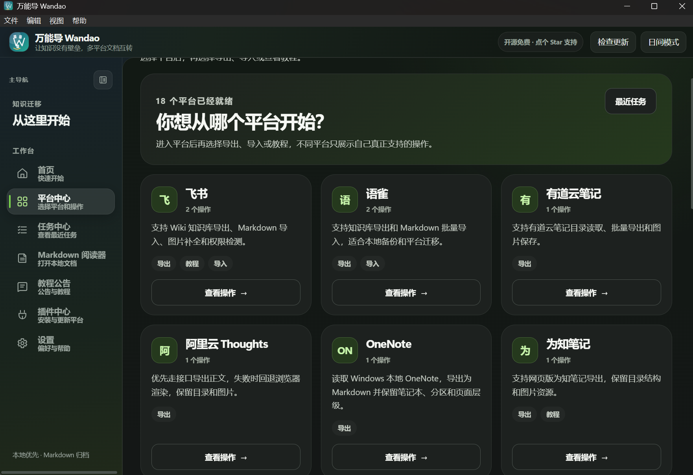

### 2. 任务中心

任务中心用于查看导入导出任务的进度、失败原因，并支持恢复未完成的任务。所有任务记录都保存在本机，不会上传到云端。你还可以按关键词、状态或平台筛选历史任务。

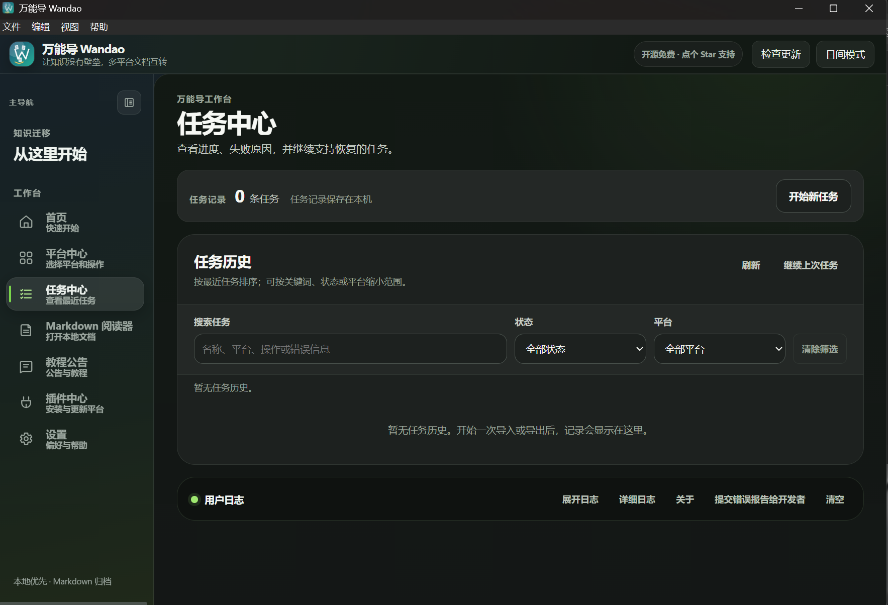

### 3. Markdown 阅读器

Markdown 阅读器可以直接打开本地 Markdown 文档进行阅读，方便你检查导出的文档内容是否完整，也可以用来预览即将导入到其他平台的文档效果。

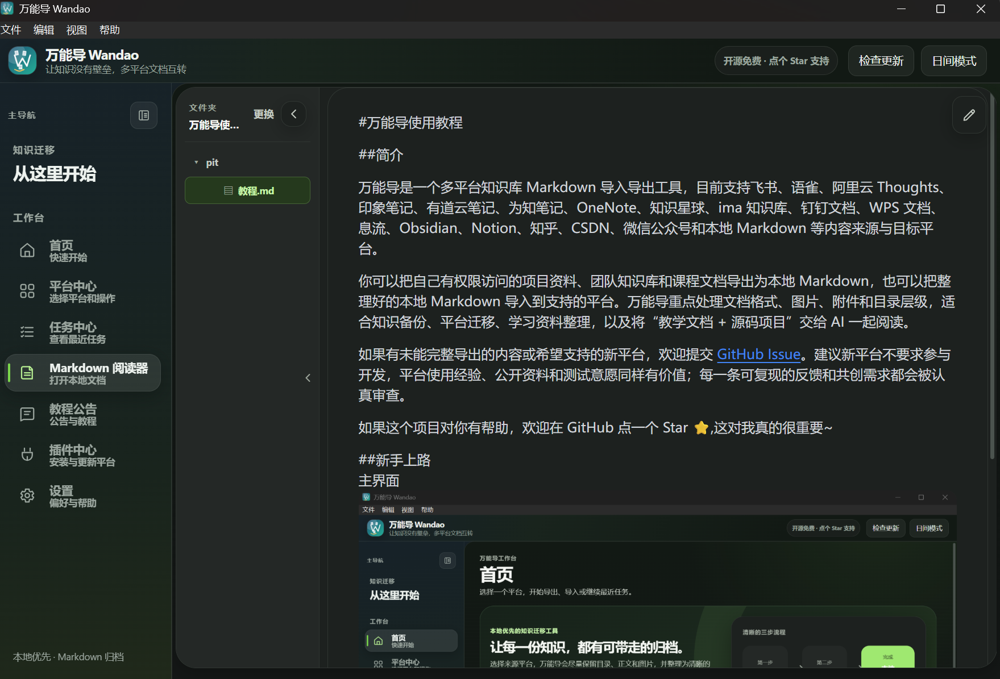

### 4. 教程公告

教程公告页面从 GitHub 仓库同步公告与教程内容，可以在这里了解万能导的最新动态、共创邀请和使用技巧。

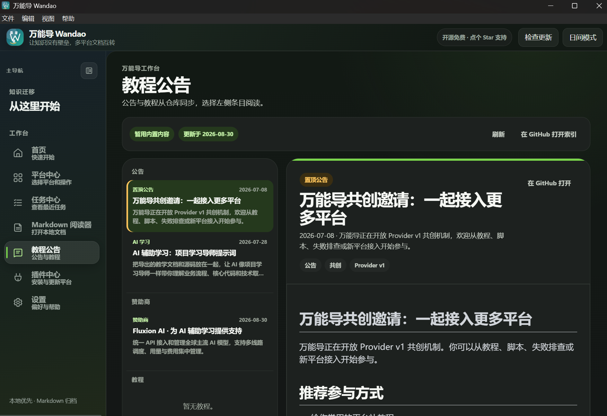

### 5. 插件中心

插件中心按需安装平台能力，插件更新不需要重新安装万能导。你只需要安装自己实际使用的平台插件即可。插件包会校验官方签名和文件完整性，稳定与实验插件都会显示，并以标签说明成熟度。

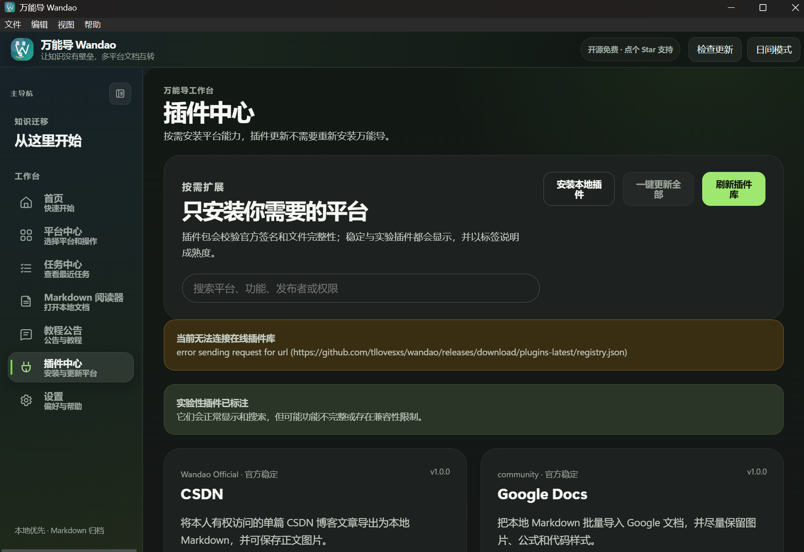

插件更新同样在平台卡片上完成：当某个平台的插件有新版本时，平台中心的对应卡片会出现「插件可更新」标签和绿色的「更新插件」按钮，点击即可直接更新该平台插件；也可以在插件中心使用「一键更新全部」批量更新，或点击「刷新插件库」检查最新版本。

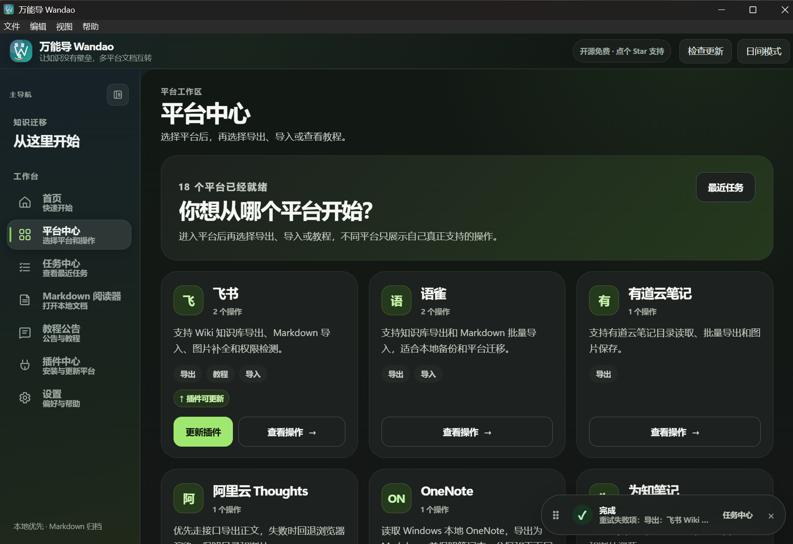

### 6. 设置

设置页面分为五个模块：

- **自动化浏览器**：万能导在登录和读取部分网页时会使用 Chrome、Edge 或 Chromium，通常保持「自动检测」即可；也可以手动选择浏览器或下载 Chrome。
- **显示模式**：切换日间/夜间主题。
- **版本更新**：同时检查万能导与平台插件的新版本。
- **日志显示**：在用户日志与详细日志之间切换，便于排查问题。
- **表单记忆**：一键清除各插件最近 3 条表单输入记录。

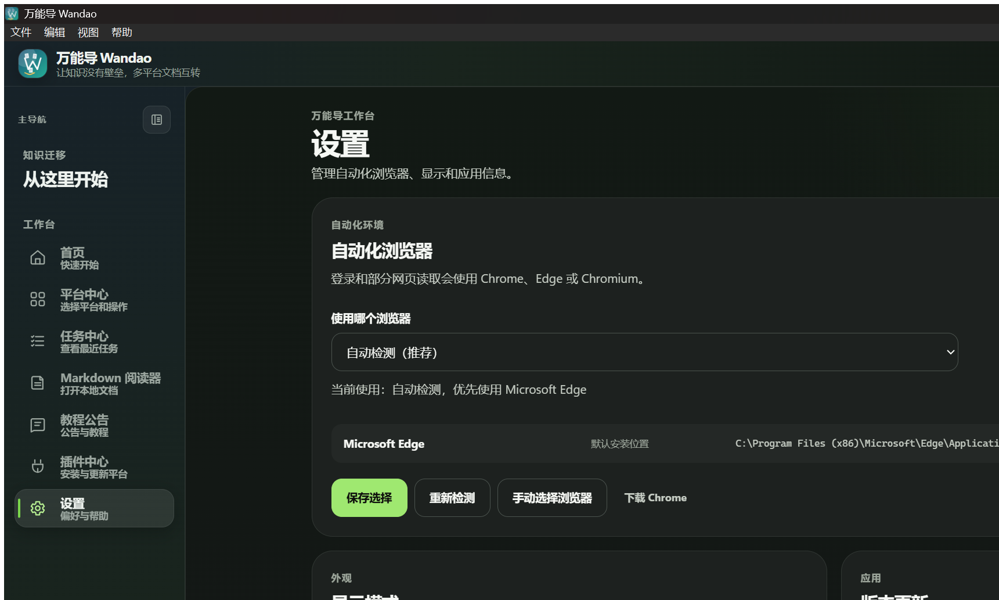

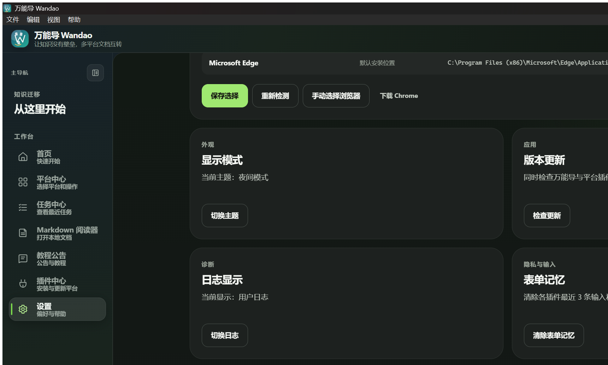

## 导入与导出

所有平台的导入导出都遵循同一套流程：在「平台中心」选择平台，进入平台页后选择导出或导入操作，填写配置后执行，最后在「任务中心」查看进度和结果。下面以飞书为例完整走一遍导出流程，导入流程类似。

### 1. 选择平台和操作

在平台中心点击目标平台卡片上的「查看操作」，进入平台工作区。页面会列出该平台支持的所有操作卡片，每张卡片标注了操作类型（导出/导入）和功能说明，点击卡片上的「开始」进入配置表单。

以飞书为例，平台页提供两张操作卡片：

- **飞书 Wiki Markdown 导出**：读取飞书 Wiki 目录并批量导出 Markdown、图片和目录结构；已保存 OpenAPI 凭证时优先完整读取长文档。
- **Markdown 导入飞书 Wiki**：通过飞书 OpenAPI 批量导入本地 Markdown，修复图片并移动到目标 Wiki。

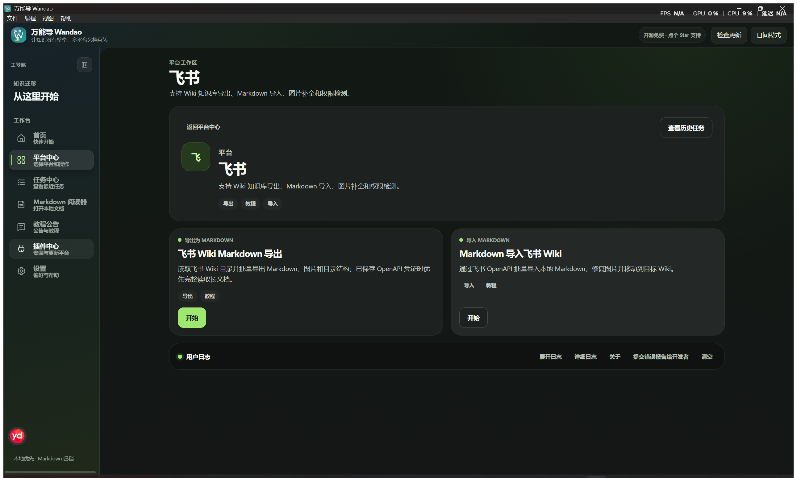

### 2. 填写导出配置

导出表单通常包含以下内容：

- **来源地址**：填写要导出的页面、知识库或文件夹链接（必填）。
- **输出目录**：导出的 Markdown 保存到本机的位置，可点击「浏览」选择；最近使用过的目录会保存在本机，方便下次快速选用。
- **导出选项**：可展开配置图片下载、目录层级等细节。
- **凭证**：部分平台需要先「登录并保存凭证」（如 OpenAPI 的 App ID / App Secret），保存后可复用。

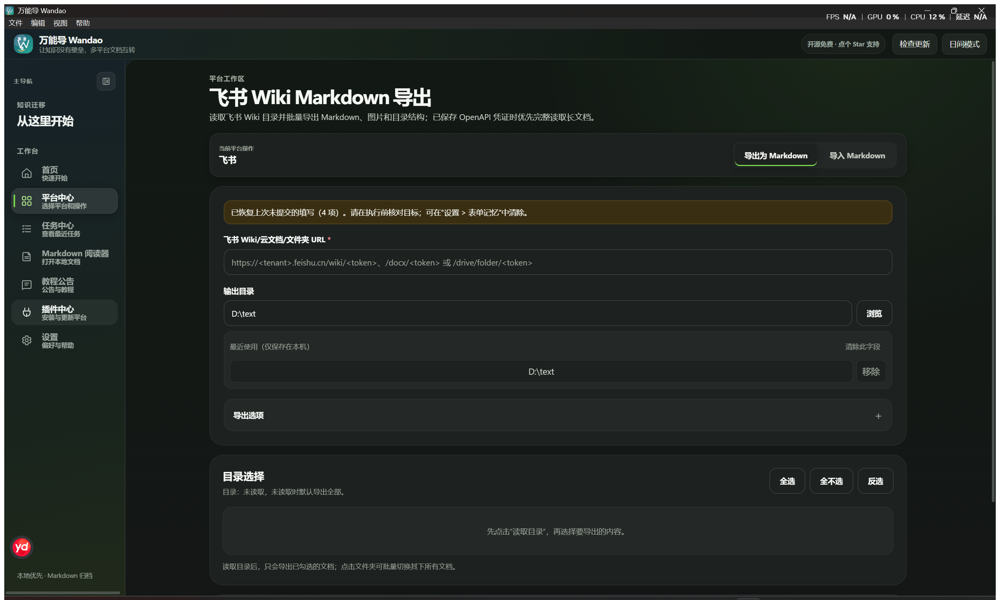

其他平台的导出表单结构基本一致，只是字段名随平台略有差异。例如语雀的导出表单要求填写「语雀知识库 URL」和输出目录：

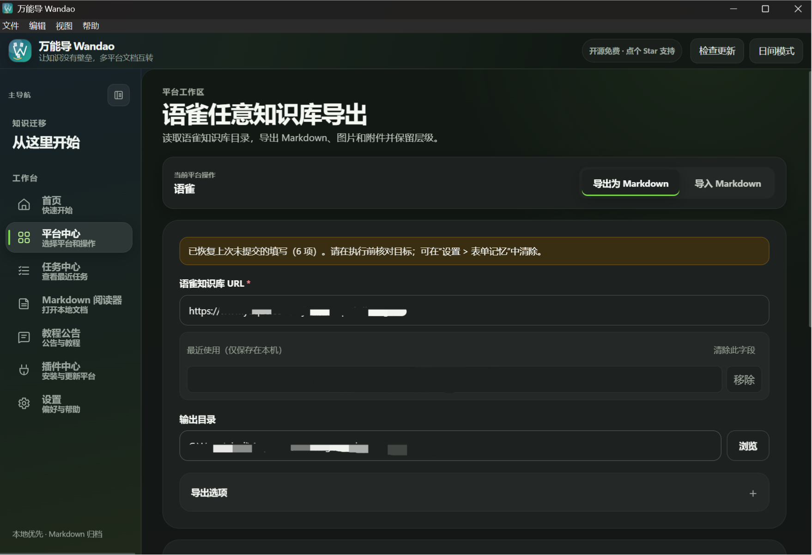

### 3. 读取目录并勾选内容

点击「读取目录」拉取文档树，然后用「全选 / 全不选 / 反选」批量勾选要导出的内容。不读取目录时默认导出全部。读取目录后，只会导出已勾选的文档；点击文件夹可批量切换其下所有文档。目录上方会显示统计信息（如「共 977 篇，已选择 977 篇」），方便确认勾选范围。

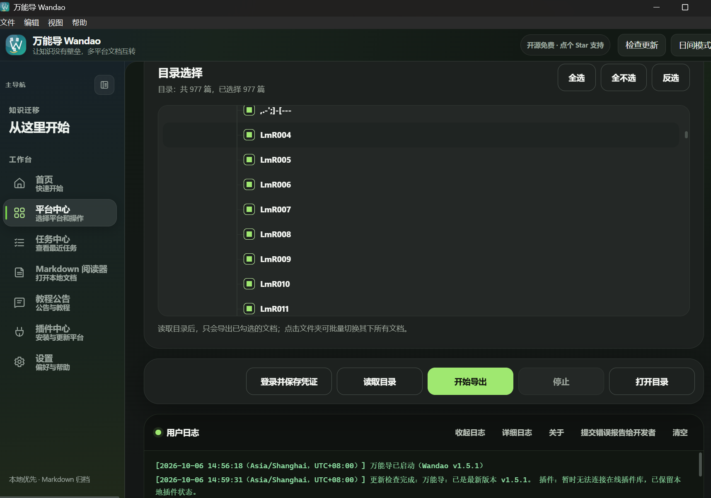

### 4. 开始导出并查看进度

点击「开始导出」执行任务，过程中可随时「停止」。执行过程中的关键节点（登录、读取目录、开始导出、导出完成等）都会实时输出到页面底部的用户日志。任务完成后，右下角会弹出完成通知，点击「任务中心」可以直接跳转查看结果；也可以点击「打开目录」直接查看导出的 Markdown 文件。

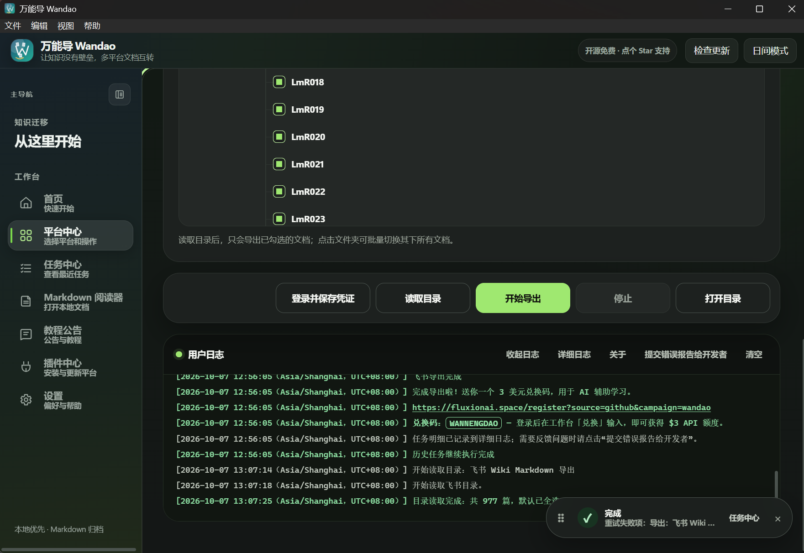

### 5. 查看报错与排查

任务失败时不要慌，万能导提供了两层排错入口：

- **页面底部用户日志**：操作页面最下方有一条「用户日志」栏，实时显示当前任务的执行日志。点击「展开日志」查看完整输出，点击「详细日志」可切换更详细的调试信息，便于定位问题。
- **任务中心失败记录**：任务失败的原因会记录在任务中心对应条目里，支持恢复的任务可以直接从失败处继续，不用从头重来。

常见报错原因包括：链接无访问权限、凭证失效或权限不足、目标文档被删除、网络超时等。根据日志提示修正配置后重新执行即可。

任务中心的每条记录都带有状态标签（已完成 / 部分完成）和统计信息（总数、导出、跳过、失败、正文成功、图片成功、文档失败）。部分完成的任务支持一键「重试失败项」，只补跑失败的部分。每条记录还提供「复制报告」「打开报告」「打开输出」「导出失败日志」等操作，方便保存证据或反馈给开发者。

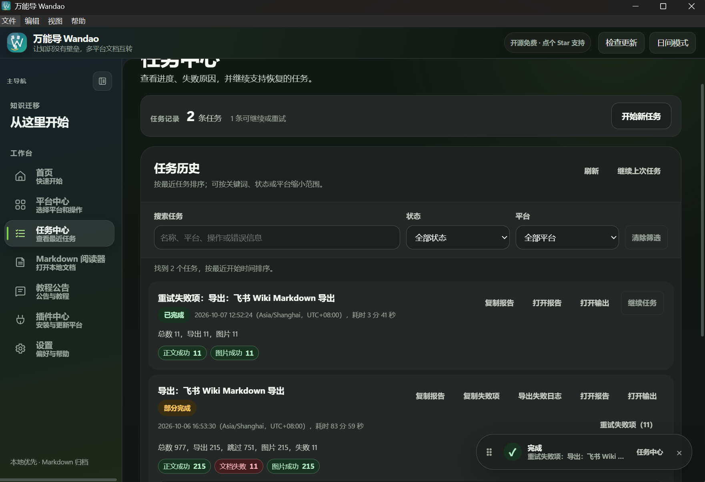

### 6. 导入配置

导入表单与导出类似，通常包含：

- **目标地址**：要导入到的目标页面或知识库链接（必填）。
- **本地 Markdown 目录**：要导入的本地文档所在文件夹（必填）。
- **单篇测试文件（可选）**：正式批量导入前，可以先只导入一篇文档验证格式和图片效果，留空则使用目录内第一篇。
- **API 凭证**：通过 OpenAPI 导入的平台需要填写 App ID / App Secret，表单内会提供「保存 API 配置」「初始化权限」「检查应用身份」等辅助按钮，按页面提示逐步完成首次配置即可。

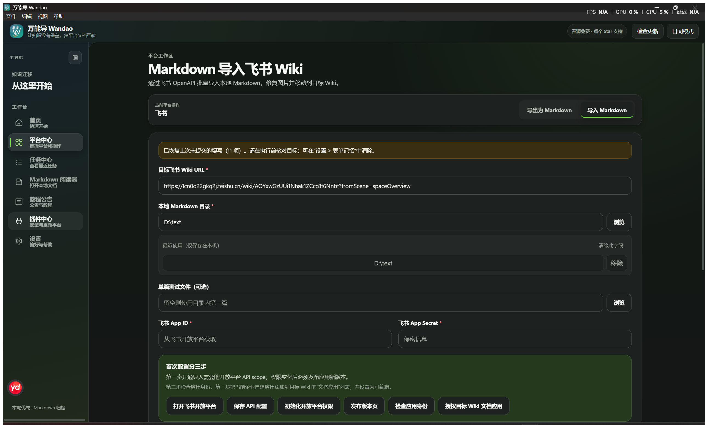

### 7. 实用建议

- **先小规模试跑**：批量导入前先用「单篇测试文件」验证效果，确认格式、图片没问题后再跑全量。
- **善用表单记忆**：表单输入会自动保存在本机，下次打开自动恢复；如需清除，可在「设置 > 表单记忆」中一键清除。
- **导出后用阅读器检查**：导出完成后可在「Markdown 阅读器」里打开文档，确认正文、图片和目录层级完整。
- **凭证安全**：App Secret 等凭证只保存在本机，注意不要把包含凭证的配置文件分享给他人。
