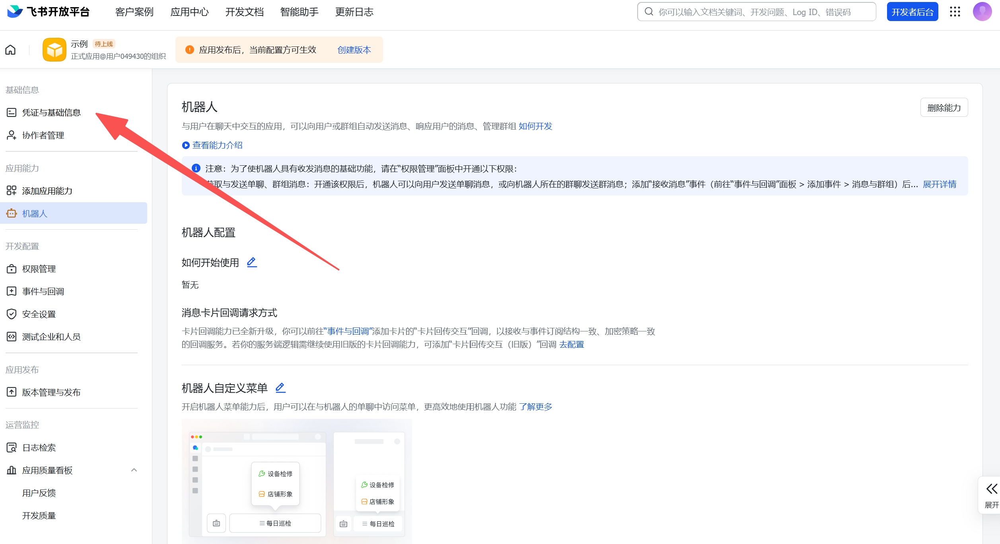
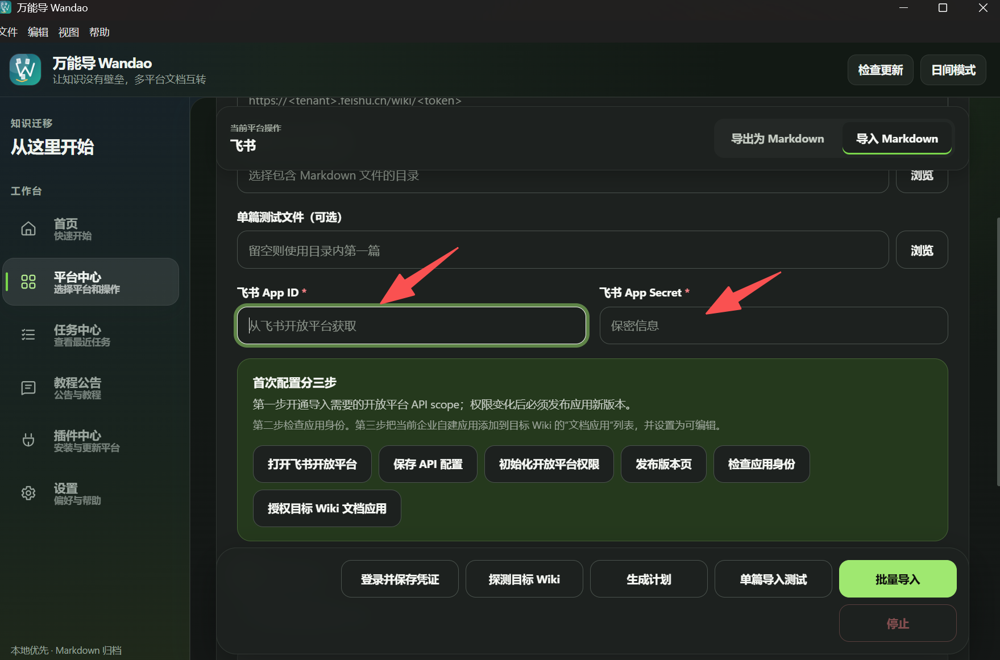
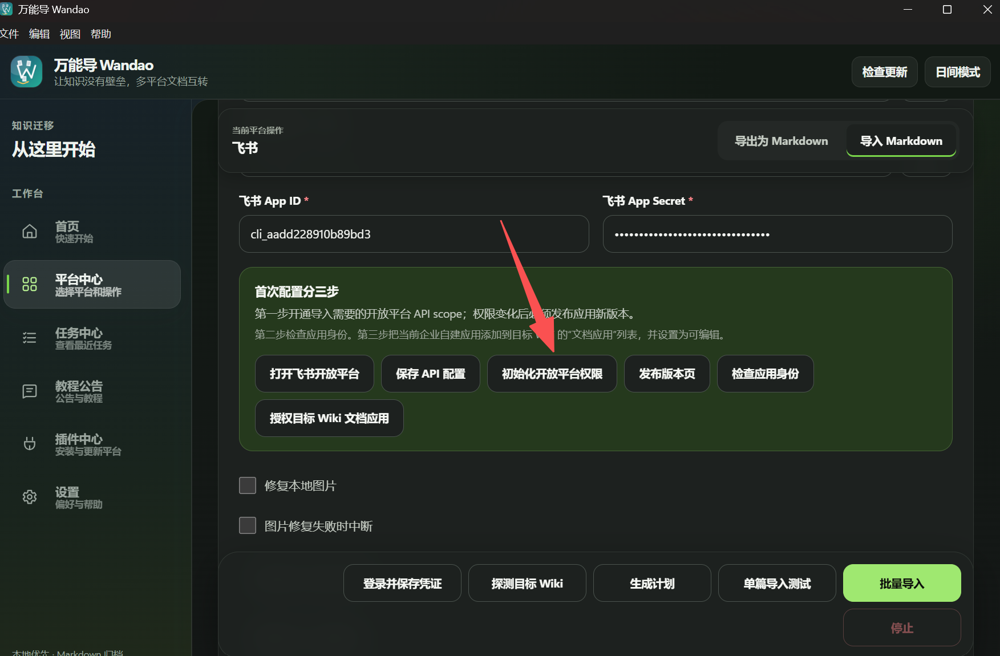
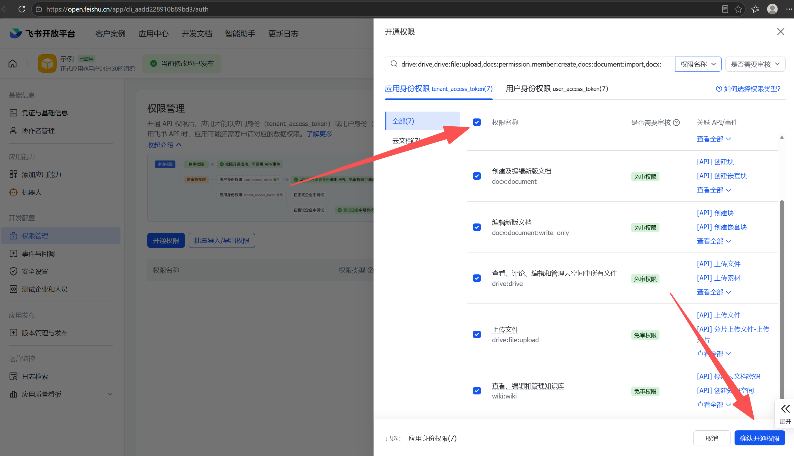
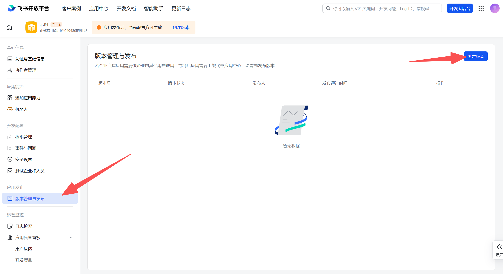
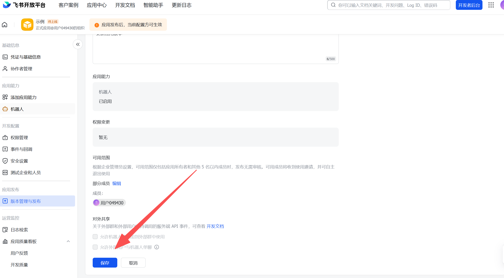
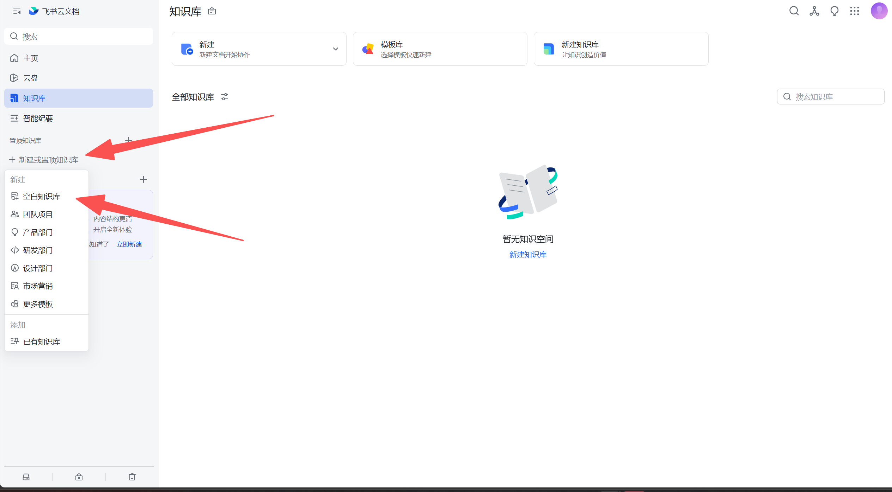
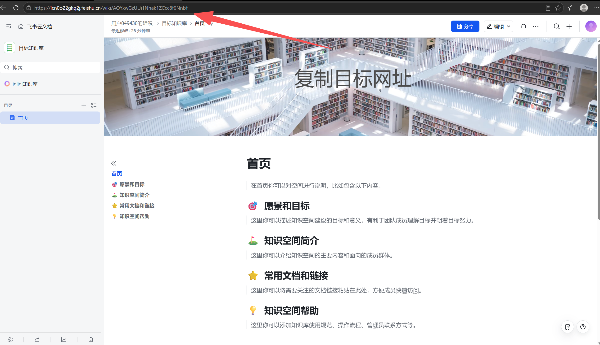
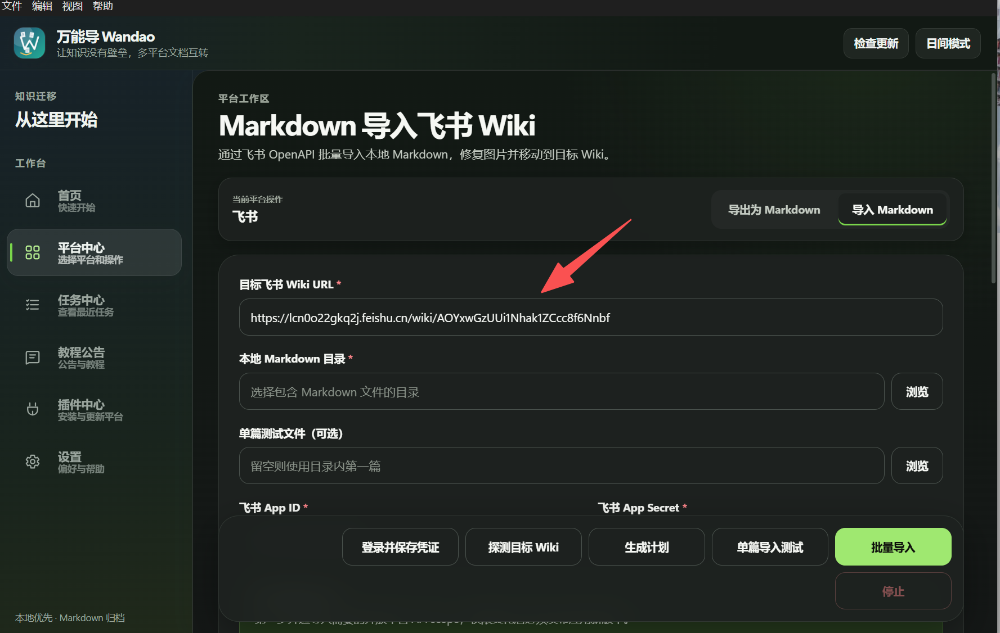
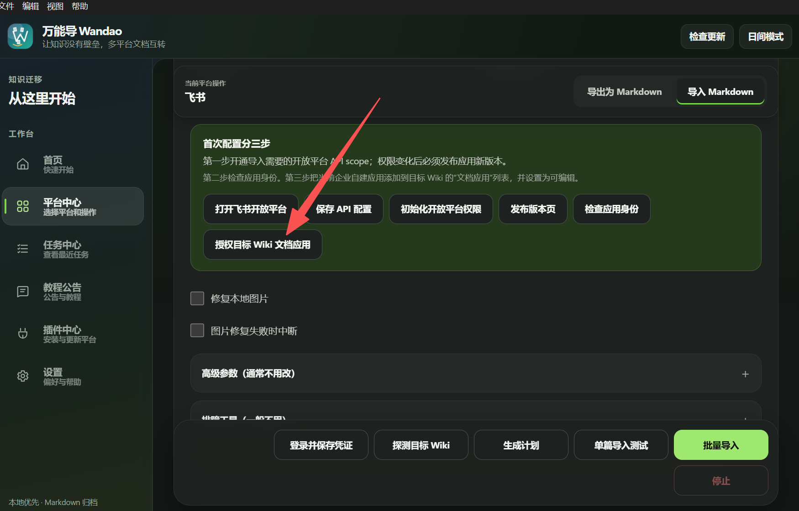

# 飞书文档导入教程

## 一、准备工作

飞书官方网站：[https://www.feishu.cn/?from_site=lark](https://www.feishu.cn/?from_site=lark)。

1. 在官方网站进行登录

2. 打开飞书开放平台 -> 开发者后台

3. 创立企业自建应用

4. **添加机器人功能**

5. 复制凭证信息并填入万能导

6. 开通身份权限

7. **发布版本**

## 二、正式导出

1. 进入知识库获取 **URL**

2. 点击 **授权目标文档应用**

接下来您就能对此知识库进行导出了。
